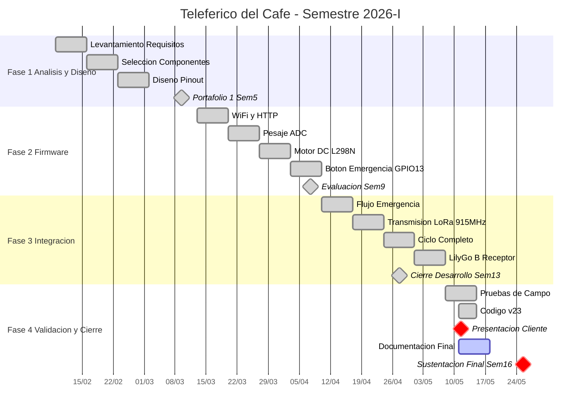

# 🚡 Teleférico del Café

**Autores:** Erick Santiago Cruz Silva · Rohin Heliab Suarez Gallego · Daniel Steven Ruales Cuaran · Kevin Esteban Aragon Camacho  
**Programa:** Ingeniería Electrónica — Proyecto CDIO III

El **Teleférico del Café** es un sistema embebido de pesaje agroindustrial diseñado para la medición y registro automatizado del café recolectado por trabajadores en campo. El sistema integra dos nodos LilyGo TTGO LoRa32: el **Nodo A (Transmisor)** que gestiona el pesaje, el control del motor DC y la interfaz del operario, y el **Nodo B (Receptor)** que almacena los registros y sirve la lista de trabajadores por WiFi.

## 📑 Tabla de Contenidos
- [Tecnologías Utilizadas](#️-tecnologías-utilizadas)
- [Requisitos de Entrega (PMV)](#️-requisitos-de-entrega-pmv)
- [Cronograma de Ejecución](#-cronograma-de-ejecución)
- [Estructura del Repositorio](#-estructura-del-repositorio)

---

## 🛠️ Tecnologías Utilizadas
- **Microcontrolador:** LilyGo TTGO LoRa32 (ESP32 + SX1276 915MHz)
- **Comunicación:** LoRa 915MHz (SF7, BW 125kHz) · WiFi HTTP
- **Lenguaje Core:** C/C++ (Arduino Framework)
- **Sensor de Peso:** Potenciómetro 10kΩ — ADC 12 bits, resolución 0.1g
- **Actuador:** Motor DC con driver L298N — control PWM
- **Interfaz:** LCD 16x2 I2C (PCF8574, dirección 0x27)
- **Librerías:** LoRa (Sandeep Mistry) · LiquidCrystal I2C · ArduinoJson v6 · HTTPClient

---

## ⚠️ Requisitos de Entrega (PMV)
Estado actual de los entregables obligatorios para la sustentación final:

- [x] **Gestión:** Cronograma actualizado, bitácoras semanales y metodologías de trabajo en equipo.
- [x] **Hardware:** Conexiones LilyGo A + LCD + L298N + Motor + Botones + Potenciómetro.
- [x] **Firmware:** Código fuente v23 estable con manejo de dependencias y anti-rebote BTN_STOP.
- [x] **Comunicación:** Transmisión LoRa 915MHz verificada a 50m en campo abierto.
- [x] **Pruebas de Campo:** 10 ciclos consecutivos sin fallos. Validación LoRa a 30m con obstáculos.
- [ ] **Dossier de Ingeniería:**
  - [ ] Planos electrónicos y diagrama de flujo de estados.
  - [ ] Manual de usuario y matriz de cumplimiento.
  - [ ] Video demostrativo del sistema en operación.

---

## 📊 Cronograma de Ejecución

El siguiente diagrama detalla el plan de trabajo semestral desde el inicio de clases hasta el cierre definitivo en la **Semana 16**.

> **Nota:** La línea vertical indica la fecha actual.

---

## 📁 Estructura del Repositorio
