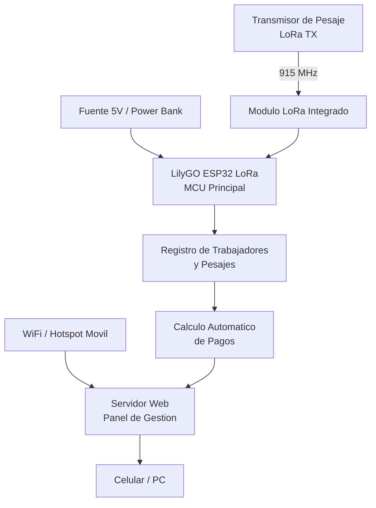

# 🔧 Diseño de Hardware y Arquitectura — TELESFÉRICO DE CAFÉ

Este directorio documenta la arquitectura electrónica, el diseño físico y la integración del sistema **TELESFÉRICO DE CAFÉ**. El hardware fue diseñado para operar en entornos cafeteros mediante comunicación inalámbrica **LoRa**, permitiendo registrar cargas de café y visualizar datos en tiempo real mediante una interfaz web.

---

## 📐 Vista General del Sistema

El sistema se compone de un **módulo receptor basado en LilyGO ESP32 LoRa**, encargado de recibir los datos enviados por el nodo transmisor, procesarlos y publicarlos en una interfaz web accesible desde celular o computador.

El sistema integra:

- Comunicación inalámbrica **LoRa 915 MHz**
- Conectividad **WiFi**
- Servidor web embebido
- Gestión de trabajadores
- Cálculo automático de pagos
- Descarga de reportes

### Especificaciones del Sistema

* **Microcontrolador principal:** LilyGO ESP32 LoRa V2  
* **Comunicación inalámbrica:** LoRa 915 MHz  
* **Conectividad:** WiFi / Hotspot móvil  
* **Interfaz:** Panel web responsivo  
* **Alcance LoRa:** Largo alcance (dependiente del entorno)  
* **Alimentación:** USB 5V / Power Bank  

---

## ⚡ Diagrama de Arquitectura

El sistema utiliza una arquitectura basada en **recepción LoRa + servidor web**, permitiendo que el nodo transmisor envíe los datos de pesaje y el receptor actualice la información automáticamente.



---

## 📡 Arquitectura de Comunicación

El sistema funciona mediante el envío de paquetes de datos desde el transmisor hacia el receptor utilizando **LoRa**.

### Formato del paquete

```txt
PESAJE,NOMBRE,PESO,PAGO
```

### Ejemplo

```txt
PESAJE,Juan,52.350,62820.000
```

Donde:

| Campo | Función |
|---|---|
| `PESAJE` | Identificador del paquete |
| `NOMBRE` | Nombre del trabajador |
| `PESO` | Peso registrado |
| `PAGO` | Valor calculado |

---

## 🌐 Arquitectura del Sistema Web

El sistema incorpora un panel web embebido dentro del ESP32 para la administración y monitoreo en tiempo real.

### Funciones del Panel

- Inicio de sesión seguro
- Registro de trabajadores
- Eliminación de trabajadores
- Visualización en tiempo real
- Reinicio de contadores
- Descarga automática de reportes
- Cálculo de pagos acumulados

### Acceso al sistema

```txt
http://172.20.10.5
```

---

## 🔌 Pinout del Sistema

La tarjeta **LilyGO ESP32 LoRa V2** integra el módulo LoRa internamente con la siguiente configuración:

| Señal | GPIO |
| :--- | :---: |
| LoRa SCK | GPIO 5 |
| LoRa MISO | GPIO 19 |
| LoRa MOSI | GPIO 27 |
| LoRa SS | GPIO 18 |
| LoRa RESET | GPIO 23 |
| LoRa DIO0 | GPIO 26 |

### Frecuencia de operación

```txt
915 MHz
```

---

*TELESFÉRICO DE CAFÉ © 2026 — Diseño de Hardware y Arquitectura del Sistema*
