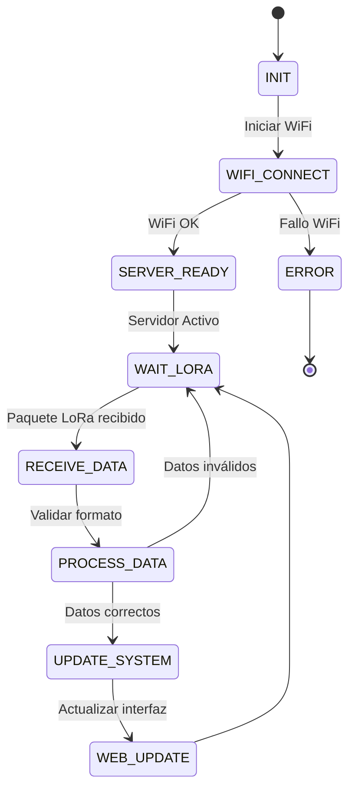

# ⚡ Firmware TELESFÉRICO DE CAFÉ (ESP32 LoRa Core)

Este directorio contiene el código fuente en **C++** para la tarjeta **LilyGO ESP32 LoRa**. El firmware implementa la lógica de **recepción inalámbrica LoRa**, procesamiento de pesajes, cálculo automático de pagos y visualización de datos mediante un **servidor web en tiempo real**.

---

## 🛠️ Entorno de Desarrollo

En esta sección se definen las herramientas, plataforma y dependencias necesarias para compilar, cargar y mantener el firmware del sistema.

* **Platform:** PlatformIO (Recomendado) o Arduino IDE  
* **Framework:** Arduino  
* **Board:** `ESP32 Dev Module` *(LilyGO ESP32 LoRa V2)*

### Dependencias (Librerías)

Las siguientes librerías son **obligatorias** para compilar el proyecto y permiten la correcta interacción entre el ESP32, LoRa y el sistema web:

1. **LoRa by Sandeep Mistry**  
   (Comunicación inalámbrica LoRa entre transmisor y receptor).

2. **ESPAsyncWebServer**  
   (Servidor web asíncrono para la interfaz del sistema).

3. **AsyncTCP**  
   (Comunicación TCP requerida por ESPAsyncWebServer).

4. **WiFi** *(Incluida en ESP32)*  
   (Conexión WiFi para acceder al panel web).

5. **SPI** *(Incluida en ESP32)*  
   (Comunicación SPI utilizada por el módulo LoRa).

6. **time / NTP** *(Incluida en ESP32)*  
   (Sincronización automática de fecha y hora para reportes).

---

## 🔌 Pinout (Mapa de Conexiones)

La tarjeta **LilyGO ESP32 LoRa** ya incluye el módulo LoRa integrado internamente. Esta es la configuración utilizada en el firmware:

| Componente | GPIO ESP32 |
| :--- | :---: |
| **LoRa SCK** | GPIO 5 |
| **LoRa MISO** | GPIO 19 |
| **LoRa MOSI** | GPIO 27 |
| **LoRa NSS (SS)** | GPIO 18 |
| **LoRa RESET** | GPIO 23 |
| **LoRa DIO0** | GPIO 26 |
| **Frecuencia LoRa** | 915 MHz |

### Configuración WiFi
El sistema utiliza conexión WiFi o hotspot móvil para acceder al panel web:

```cpp
const char* WIFI_SSID = "TuWiFi";
const char* WIFI_PASS = "TuContraseña";
```

---

## 🧠 Lógica del Sistema (Arquitectura)

El sistema funciona mediante una lógica de recepción y procesamiento en tiempo real. Cada vez que un transmisor envía un pesaje por **LoRa**, el receptor procesa automáticamente los datos y actualiza la interfaz web.

### Flujo del Sistema



---

## 📡 Comunicación LoRa

El sistema recibe los datos mediante el siguiente formato:

```txt
PESAJE,NOMBRE,PESO,PAGO
```

### Ejemplo de transmisión

```txt
PESAJE,Juan,52.350,62820.000
```

Donde:

| Campo | Descripción |
|---|---|
| `PESAJE` | Identificador del paquete |
| `NOMBRE` | Nombre del trabajador |
| `PESO` | Peso registrado |
| `PAGO` | Pago calculado |

---

## 🌐 Interfaz Web

El firmware incorpora un servidor web integrado para administrar el sistema en tiempo real.

### Funciones principales
- Inicio de sesión seguro
- Registro de trabajadores
- Eliminación de trabajadores
- Visualización de cargas en vivo
- Cálculo automático de pagos
- Descarga de reportes `.txt`
- Reinicio de contadores

### Acceso al sistema

```txt
http://172.20.10.5
```

### Credenciales por defecto

```txt
Usuario: admin
Contraseña: 1234
```

---

## 📁 Reportes del Sistema

El sistema genera reportes automáticos descargables que incluyen:

- Fecha y hora
- Total de cargas
- Peso acumulado
- Pago individual por trabajador
- Totales generales

Formato generado:

```txt
reporte_cafetero.txt
```

---

*TELESFÉRICO DE CAFÉ © 2026 — Sistema Inteligente de Pesaje Cafetero*
